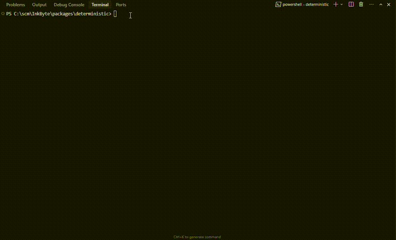

# @archrad/deterministic



<!-- GIFs: validate hero — `npm run build && vhs scripts/record-demo-validate.tape` → demo-validate.gif. Drift — `npm run record:demo:drift` → demo-drift.gif (terminal tape) or replay scripts + capture. For “edit → save → validate-drift” (IDE + terminal, skeptic-grade), see scripts/DEMO_GIF_STORYBOARD.md “Trust loop”. scripts/README_DEMO_RECORDING.md. package.json `files`. -->

**A deterministic compiler and linter for system architecture.**

**Validate your architecture before you write code.**

**For AI agents / IDE assistants:** see **`llms.txt`** in this package (llms.txt-style project summary for tools like Claude Code, Devin, etc.).

**Apache-2.0** — blueprint **IR** (JSON graph) → **FastAPI** or **Express** + **OpenAPI**, **Docker**, **Makefile** — **no LLM**, **no account**, **offline**.

**OSS positioning:** *Includes structural validation + basic architecture linting (rule-based, deterministic).*

> This is not only a generator: **`archrad validate`** treats your graph like source code — **IR-STRUCT-*** (shape/refs/cycles) and **IR-LINT-*** (light architecture heuristics: health routes, fan-out, sync chains, HTTP→DB coupling). Then **`archrad export`** compiles to runnable projects. After you have a tree on disk, **`archrad validate-drift`** compares it to a **fresh** export from the same IR (missing/changed files — **not** semantic code review). Generated **OpenAPI** gets a **document-shape** pass (parse + required fields — **not** Spectral-style spec lint).

**Open core (OSS):** **IR structural validation**, **basic architecture lint** (rule-based, deterministic), **OpenAPI document-shape** checks. **ArchRad Cloud** adds **policy / compliance**, deeper **architecture intelligence**, and **AI remediation** — see **`docs/STRUCTURAL_VS_SEMANTIC_VALIDATION.md`**.

### Concept, cold start, and strategy (honest scope)

The **core idea** is sound: **IR = what to build**, **codegen = how** — with compiler-style validation and deterministic output. **Adoption friction** is real: this repo is a **compiler with no bundled authoring UI** (JSON/graph in; you bring **ArchRad Cloud**, another tool, or hand-written IR). **Where the IR comes from** is intentionally **plural**: **manual** graph JSON/YAML today, plus **`archrad ingest openapi`** (and more ingestion surfaces over time — e.g. **IaC**). Treat **OpenAPI → IR** as a **starting lane**, not the whole roadmap: regenerate IR in CI, then **`archrad validate`** / **`archrad export`** — structural HTTP surface only, not full system semantics. Draft language for “drift / where does IR come from?” threads: **`scripts/SOCIAL_POST_DRIFT_AND_INGESTION.md`**. **Export is one-way** (no built-in round-trip from edited code back to IR)—best thought of as **scaffold + contract validation**, not full lifecycle architecture sync unless you own that workflow. Many teams will still treat the OSS layer as a **trust and CI artifact** that makes the Cloud/AI path auditable. Read **`docs/CONCEPT_ADOPTION_AND_LIMITS.md`** for the full framing and future directions (e.g. lightweight YAML/IDE ergonomics).

---

## How it works (architecture)

```
IR (nodes/edges)  →  validateIrStructural (IR-STRUCT-*)  →  errors block export
                           ↓
                    validateIrLint (IR-LINT-*)  →  warnings (CI: --fail-on-warning / --max-warnings)
                           ↓
              pythonFastAPI | nodeExpress generators
                           ↓
              openapi.yaml + app code + package metadata
                           ↓
              golden layer (Dockerfile, docker-compose.yml, Makefile, README; host→container e.g. 8080:8080)
                           ↓
              validateOpenApiInBundleStructural(openapi.yaml)  →  document-shape warnings (not full API lint)
                           ↓
              { files, openApiStructuralWarnings, irStructuralFindings, irLintFindings }

  Optional CI: archrad validate-drift  →  re-export IR in-memory, diff vs existing ./out  →  DRIFT-MISSING / DRIFT-MODIFIED (thin deterministic gate)
```

### Validation levels (quick contract)

1. **JSON Schema validation** — IR document shape vs `schemas/archrad-ir-graph-v1.schema.json` (editor/CI; optional at runtime).
2. **IR structural validation** — `validateIrStructural`: arrays, ids, HTTP `config`, edge refs, cycles (`IR-STRUCT-*`). Uses an internal **normalized** graph (see **`docs/IR_CONTRACT.md`**).
3. **Export-time generated OpenAPI structural validation** — Parse + required fields on the **generated** `openapi.yaml` (document shape, not Spectral).

**Architecture lint** (`IR-LINT-*`) sits after structural checks: rule visitors on the parsed graph (heuristics, not schema).

### Validation layers (naming)

| Layer (OSS) | What it is | Codes |
|-------------|------------|--------|
| **IR structural validation** | Graph well-formedness: ids, edges, cycles, HTTP path/method | `IR-STRUCT-*` |
| **Architecture lint (basic)** | Deterministic heuristics only (no AI, no org policy) | `IR-LINT-*` |
| **OpenAPI structural validation** (document shape) | Parse + required top-level OpenAPI fields on **generated** spec | *(string warnings, not IR codes)* |

| Layer (Cloud — not this package) | Examples |
|----------------------------------|----------|
| **Policy engine** | SOC2, org rules, entitlement |
| **Architecture intelligence** | Deeper NFR / cost / security reasoning |
| **AI remediation** | Repair loops, suggested edits |

1. **IR structural validation:** duplicate/missing node ids, bad HTTP `config.url` / `config.method`, unknown edge endpoints, directed cycles.
2. **Architecture lint:** Implemented as a **registry of visitor functions** on a parsed graph (`buildParsedLintGraph` → **`LINT_RULE_REGISTRY`** in **`src/lint-rules.ts`**). If the IR cannot be parsed, **`buildParsedLintGraph`** returns **`{ findings }`** (IR-STRUCT-*) instead of **`null`**; use **`isParsedLintGraph()`** or call **`validateIrLint`**, which forwards those findings. Each rule returns **`IrStructuralFinding[]`**; **`runArchitectureLinting`** / **`validateIrLint`** flatten them. **Custom org rules:** compose **`runArchitectureLinting`** with your own **`(g) => findings`** in CI (worked example: **`docs/CUSTOM_RULES.md`**), or **fork** and append to **`LINT_RULE_REGISTRY`** if the stock **`archrad validate`** CLI must emit your codes. CLI **`archrad validate`** / **`archrad export`** print lint under **Architecture lint (IR-LINT-*)** (grouped separately from structural). Codes include **IR-LINT-DIRECT-DB-ACCESS-002**, **IR-LINT-SYNC-CHAIN-001**, **IR-LINT-NO-HEALTHCHECK-003**, **IR-LINT-HIGH-FANOUT-004**, **IR-LINT-ISOLATED-NODE-005**, **IR-LINT-DUPLICATE-EDGE-006**, **IR-LINT-HTTP-MISSING-NAME-007**, **IR-LINT-DATASTORE-NO-INCOMING-008**, **IR-LINT-MULTIPLE-HTTP-ENTRIES-009**. **Sync-chain** depth counts **synchronous** edges only; mark message/queue/async hops via **`edge.metadata.protocol`** / **`config.async`** (see **`edgeRepresentsAsyncBoundary`** in **`lint-graph.ts`** and **`docs/ENGINEERING_NOTES.md`**).
3. **Generators** → `openapi.yaml`, handlers, deps.
4. **Golden path** → `make run` / `docker compose up --build`.
5. **OpenAPI document shape** on the bundle — **not** [Spectral](https://github.com/stoplightio/spectral)-level lint. Issues → **`openApiStructuralWarnings`**.

**IR contract:** **`schemas/archrad-ir-graph-v1.schema.json`**. **Parser boundary + normalized shapes:** **`docs/IR_CONTRACT.md`** (`normalizeIrGraph` → `materializeNormalizedGraph`).

**Trust builder:** **IR-STRUCT-*** errors block export; **IR-LINT-*** warnings are visible and can **gate CI** via **`--fail-on-warning`** / **`--max-warnings`**; OpenAPI shape issues surface as export warnings.

### Codegen vs validation (retry, timeouts, policy)

Generators **may emit** retry/timeout/circuit-breaker **code** when the IR carries matching edge or node config (e.g. `retryPolicy`). That is **code generation**, not a guarantee. OSS does **not** currently **require** or **lint** “every external call must have timeout/retry” — that class of rule is **semantic / policy** and fits **ArchRad Cloud** or custom linters on top of the IR.

---

## Ways to use it

| Mode | Best for | Example |
|------|-----------|---------|
| **CLI** | Quick local scaffolding, CI, “no Node project” usage | `archrad export --ir graph.json --target python --out ./out` |
| **YAML → IR** | Author graphs in YAML, emit JSON for validate/export | `archrad yaml-to-ir -y graph.yaml -o graph.json` |
| **OpenAPI → IR** | Derive HTTP nodes from OpenAPI 3.x (same IR shape as YAML path); **ArchRad Cloud** merge uses the same library | `archrad ingest openapi --spec openapi.yaml -o graph.json` |
| **CLI validate** | CI / pre-commit: IR structural + architecture lint, no codegen | `archrad validate --ir graph.json` |
| **CLI validate-drift** | After export or merges: on-disk tree vs fresh deterministic export from same IR | `archrad validate-drift -i graph.json -t python -o ./out` |
| **Library** (`@archrad/deterministic`) | IDPs / pipelines | `runDeterministicExport` → files + findings; **`runValidateDrift`** / **`runDriftCheckAgainstFiles`** for drift |

### CLI

**Input is structured IR (JSON), not natural language.** There is no `archrad export --prompt "..."`. You pass a **graph file** (nodes/edges) like **`fixtures/minimal-graph.json`**. The **npm README GIF** uses **`fixtures/demo-direct-db-violation.json`** → **`fixtures/demo-direct-db-layered.json`**: **failure-first** **`IR-LINT-DIRECT-DB-ACCESS-002`**, fix on the graph, then a **clean** validate (no codegen in the clip). For a graph that hits **many** lint rules at once (stress test), use **`fixtures/ecommerce-with-warnings.json`**. For a **golden payment + retry** graph (edge `config.retry.maxAttempts` + payment node `config.retryPolicy`, both `3`), use **`fixtures/payment-retry-demo.json`** — export shows **`retry_policy`** / retry helpers in **`app/main.py`**. Record that path with **`scripts/record-demo-payment-retry.tape`** (→ **`demo-payment-retry.gif`**). **Drift clip:** **`scripts/record-demo-drift.tape`** / **`npm run record:demo:drift`** (→ **`demo-drift.gif`**) — export, **`tail`** before/after a one-line tamper on **`out/app/main.py`**, then **`validate-drift`**; if **VHS** fails on your machine, run **`scripts/run-demo-drift-sequence.ps1`** or **`.sh`** while screen-capturing (see **`scripts/README_DEMO_RECORDING.md`**). See **`scripts/DEMO_GIF_STORYBOARD.md`** for all tapes. **CLI:** `--target python` is the FastAPI bundle; there is no separate `fastapi` target name. To go from **plain English → IR**, use **ArchRad Cloud** or your own LLM step; this package only does **IR → files**.

**OpenAPI → JSON (spec as source of truth):** each operation under `paths` becomes an `http` node (`config.url` + `config.method`). Then validate and export like any other IR:

```bash
archrad ingest openapi --spec ./openapi.yaml --out ./graph.json
archrad validate --ir ./graph.json
archrad export --ir ./graph.json --target python --out ./out
```

**OpenAPI security → IR → lint:** ingestion copies **global** and **per-operation** `security` requirement names onto each HTTP node as `config.security` (sorted, deterministic). An operation with explicit `security: []` becomes `config.authRequired: false` (intentionally public). If the spec declares **no** security at any level, nodes are left without those fields — then **`archrad validate`** can surface **`IR-LINT-MISSING-AUTH-010`** on HTTP-like entry nodes (compliance gap from the spec artifact alone).

**YAML → JSON (lighter authoring):** edit **`fixtures/minimal-graph.yaml`** (or your own file) and compile to IR JSON, then validate or export:

```bash
archrad yaml-to-ir --yaml fixtures/minimal-graph.yaml --out ./graph.json
archrad validate --ir ./graph.json
# or pipe: archrad yaml-to-ir -y fixtures/minimal-graph.yaml | archrad validate --ir /dev/stdin   # on Unix; on Windows use --out then validate
```

YAML must have either top-level **`graph:`** (object) or top-level **`nodes:`** (array); bare graphs are wrapped as `{ "graph": { ... } }` automatically.

After `npm run build` (required after `npm ci`; there is no `prepare` hook — see **`docs/ENGINEERING_NOTES.md`**):

```bash
node dist/cli.js export --ir fixtures/minimal-graph.json --target python --out ./my-api
node dist/cli.js yaml-to-ir --yaml fixtures/minimal-graph.yaml --out /tmp/ir.json
# After global install / npx:
archrad export --ir ./graph.json --target node --out ./my-express-api

# Validate IR (structural + architecture lint). Pretty output; exit 1 on structural errors by default:
node dist/cli.js validate --ir fixtures/minimal-graph.json
# Machine-readable + CI gates:
archrad validate --ir ./graph.json --json
archrad validate --ir ./graph.json --fail-on-warning
archrad validate --ir ./graph.json --max-warnings 0
# Structural only (skip IR-LINT-*):
archrad validate --ir ./graph.json --skip-lint
```

**Deterministic drift (thin, OSS):** compare an existing export tree on disk to a **fresh** export from the same IR. Detects **missing** / **changed** generated files (line endings normalized). Optional **`--strict-extra`** flags files present on disk but not in the reference export. Not semantic “does code match intent” — **ArchRad Cloud** adds builder/UI drift checks and broader governance.

```bash
archrad export -i ./graph.json -t python -o ./out
# …edit files under ./out…
archrad validate-drift -i ./graph.json -t python -o ./out --skip-host-port-check
# CI-friendly:
archrad validate-drift -i ./graph.json -t python -o ./out --skip-host-port-check --json
# Fail if the tree has extra files not in the reference export:
archrad validate-drift -i ./graph.json -t python -o ./out --strict-extra
```

Regenerate the matching clip: **`npm run record:demo:drift`** (VHS) → **`demo-drift.gif`**, or **`scripts/run-demo-drift-sequence.ps1`** / **`.sh`** + ShareX/OBS if VHS is unavailable (see **`scripts/DEMO_GIF_STORYBOARD.md`**).

#### Example: validate architecture

```bash
archrad validate --ir fixtures/minimal-graph.json
```

Example output (stderr):

```text
archrad validate:
⚠️ IR-LINT-NO-HEALTHCHECK-003: No HTTP node exposes a typical health/readiness path (...)
   Fix: Add a GET route such as /health for orchestrators and load balancers.
   Suggestion: Expose liveness vs readiness separately if your platform distinguishes them.
   Impact: Weaker deploy/rollback safety and harder operations automation.
```

Structural errors look like **`❌ IR-STRUCT-...`** with **`Fix:`** lines. Use **`--json`** to consume findings in GitHub Actions or other CI.

- **`--ir`** — JSON: `{ "graph": { "nodes", "edges", "metadata" } }` or a raw graph (CLI wraps it).
- **`--target`** — `python` \| `node` \| `nodejs`
- **`--out`** — output directory (created if needed)
- **`--host-port <n>`** — host port Docker publishes (default **8080**; container still listens on **8080** inside). Same as env **`ARCHRAD_HOST_PORT`**.
- **`--skip-host-port-check`** — don’t probe `127.0.0.1` before export.
- **`--strict-host-port`** — **exit with error** if the host port appears **in use** (CI-friendly).
- **`--danger-skip-ir-structural-validation`** — **UNSAFE:** skip **`validateIrStructural`** before export (never in CI). **Parse/normalize failures** (invalid root, empty graph) are still detected via **`validateIrLint`** and **block** export with **`IR-STRUCT-*`** in **`irStructuralFindings`**. A hidden **`--skip-ir-structural-validation`** remains as a deprecated alias.
- **`--skip-ir-lint`** — skip **`validateIrLint`** during export.
- **`--fail-on-warning`** / **`--max-warnings <n>`** — if set, **no files are written** when IR structural + lint findings violate the policy (same semantics as **`validate`**).

By default, if **8080** (or your `--host-port`) looks **busy** on localhost, the CLI **warns** so you can change the port before `docker compose` fails with a bind error.

**Export** runs **IR structural validation**, then **architecture lint**, then codegen. **Structural errors** abort with **no files written**. **`irLintFindings`** contains only **`IR-LINT-*`**; **`IR-STRUCT-*`** from a failed parse always appear under **`irStructuralFindings`** (including when structural validation was skipped). **Lint warnings** print by default; use **`--fail-on-warning`** / **`--max-warnings`** to block writes for CI.

### Validate the package as a developer

1. `cd packages/deterministic && npm ci && npm run build && npm test`
2. `node dist/cli.js export --ir fixtures/minimal-graph.json --target python --out ./tmp-out`
3. `cd tmp-out && make run` then `curl` the URL shown in the generated **README** (port matches `--host-port` if you set it).
4. Optional: `node dist/cli.js export ... --host-port 18080` if **8080** is already taken.

### Library

```typescript
import {
  runDeterministicExport,
  runValidateDrift,
  validateIrStructural,
  validateIrLint,
  sortFindings,
  shouldFailFromFindings,
} from '@archrad/deterministic';

const { files, openApiStructuralWarnings, irStructuralFindings, irLintFindings } =
  await runDeterministicExport(ir, 'python', {
    hostPort: 8080,
    skipIrLint: false, // default
  });
// Structural errors → empty files (unless skipIrStructuralValidation). Lint is non-blocking for export unless you check policy in your pipeline.

const drift = await runValidateDrift(ir, 'python', '/path/to/existing-export', {
  skipIrLint: false, // set true to match CLI --skip-ir-lint on reference export
});
// drift.ok, drift.driftFindings, drift.exportResult — same core semantics as CLI validate-drift (CLI also probes host port before calling the library)

const all = sortFindings([...validateIrStructural(ir), ...validateIrLint(ir)]);
if (shouldFailFromFindings(all, { failOnWarning: true })) {
  /* gate your CI */
}
```

Optional: `isLocalHostPortFree` / `normalizeGoldenHostPort` from the same package if you want your own preflight.

---

## Golden path (~60 seconds)

From the package root (after build):

```bash
node dist/cli.js export --ir fixtures/minimal-graph.json --target python --out ./out
cd ./out
make run
# In another terminal, once the API is up:
curl -sS -X POST http://localhost:8080/signup -H "Content-Type: application/json" -d '{}'
```

You should see **422 Unprocessable Entity** (FastAPI/Pydantic) or **400** with a clear body — proof the stack is live and validation matches the spec, not a silent 500.

**Helper script** (prints the same flow; use when recording a terminal GIF):

```bash
bash scripts/golden-path-demo.sh
```

See **`scripts/README_DEMO_RECORDING.md`** for **VHS / asciinema / ttyrec** tips, **When VHS fails**, **drift** replay scripts, and the **trust loop** (IDE edit + terminal **`validate-drift`**). The hero GIF at the top is **`demo-validate.gif`**; **`demo-drift.gif`** and the **trust-loop** storyboard live in **`scripts/DEMO_GIF_STORYBOARD.md`**.

---

## Open source vs ArchRad Cloud

**This repository is only the deterministic engine** — local, offline, no phone-home.

| Here (OSS) | ArchRad Cloud (commercial product) |
|------------|-------------------------------------|
| IR **structural** + **architecture lint** (`validate`, `IR-STRUCT-*`, `IR-LINT-*`), compiler (`export`), **`validate-drift`** (on-disk vs fresh export), OpenAPI **document-shape** warnings, golden Docker/Makefile | **Policy engine**, deeper **architecture intelligence**, **AI remediation**, richer **drift / sync** UX in the builder |
| `archrad` CLI forever, no account required for this package | Auth, orgs, **quotas**, billing |
| No proprietary **LLM** orchestration or “repair” loops | LLM generation, repair, multi-model routing |
| No Git sync, no enterprise policy injection in this repo | Git push, governance, compliance dashboards |

You can depend on this CLI and library **without** ArchRad Cloud. The cloud product stacks collaboration and AI on top of the same deterministic contract.

**InkByte vs this package:** Deeper workflow analysis, enterprise validation routes, and LLM-assisted flows may exist in the **private InkByte monorepo** (`server/`, etc.); they are **not** part of the **`@archrad/deterministic`** npm surface unless shipped here. This README describes **only** what the OSS package proves.

---

## Monorepo vs public OSS repo

The **canonical source** for this engine may live in a **private monorepo** next to the full product; `server` can depend on `file:../packages/deterministic`. The **public** GitHub repo should contain **only** this package — canonical clone: **`https://github.com/archradhq/arch-deterministic`**. Subtree publish: **`docs/OSS_VS_PRODUCT_REPOS.md`** and **`docs/PUBLISH_DETERMINISTIC_OSS.md`** (in the product monorepo).

---

## Publishing the public OSS repo

From the private monorepo root: **`docs/PUBLISH_DETERMINISTIC_OSS.md`**. This tree includes **`.github/workflows/ci.yml`** and **Dependabot**; they run when this folder is the **git root** of the public repo.

---

## Contributing

See **`CONTRIBUTING.md`**.

---

## License

Apache-2.0 — see **`LICENSE`**.
