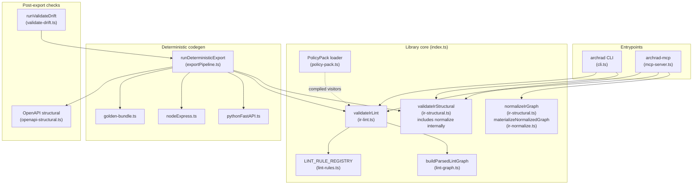
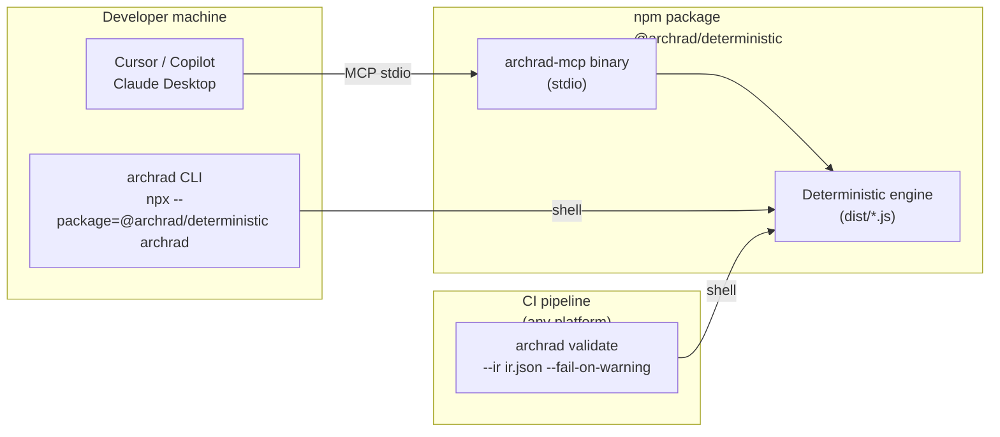
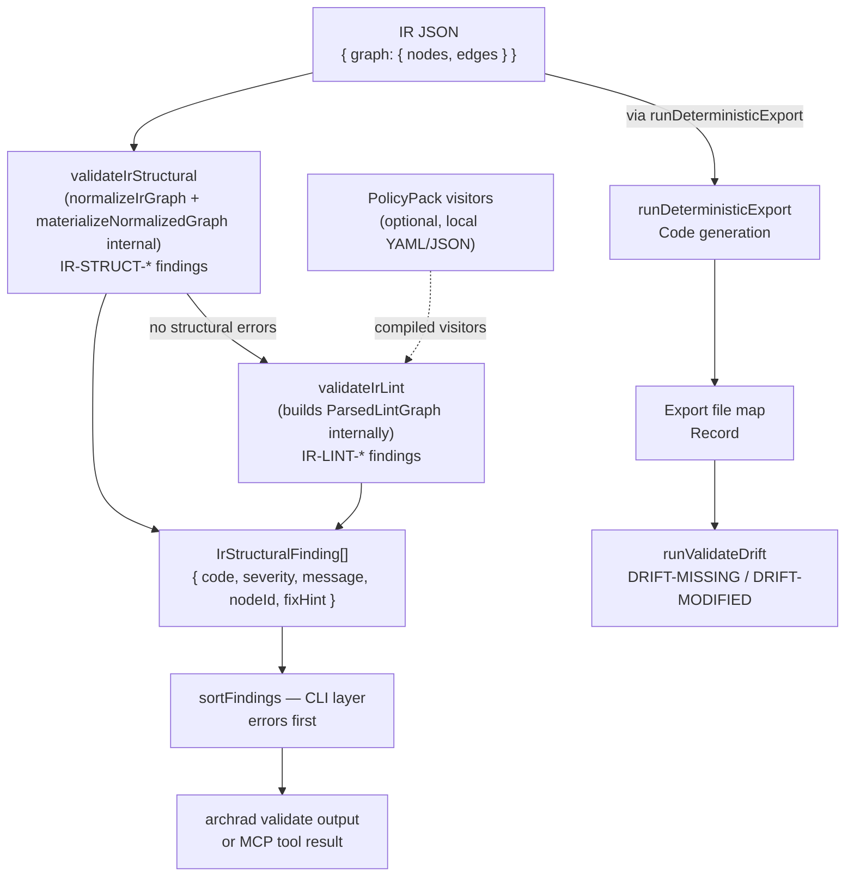
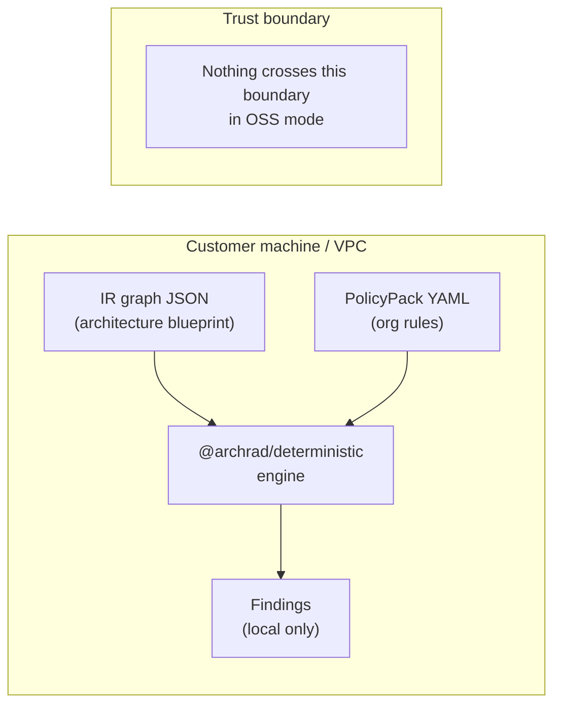

# OSS technical architecture — `@archrad/deterministic`

High-level **component view** of the public package. For **sequence / phase flows**, see [OSS_FLOWS.md](./OSS_FLOWS.md).

---

## Overview

`@archrad/deterministic` is a **deterministic compiler and linter for system architecture**. It validates architecture IR (Intermediate Representation) graphs against structural rules and lint policies — no AI, no network calls, no cloud dependency. Everything runs locally.

**Core principle:** Entrypoints (CLI / MCP) call a library core. For `archrad validate`, the CLI calls `validateIrStructural` and `validateIrLint` directly — normalization runs inside those functions. The logical chain is `normalize → structural → lint → (optional) export → (optional) drift`. No circular dependency from generators back into validation beyond explicit re-validate call sites in the export/drift orchestration.

---

## Layered architecture



---

## Runtime deployment

Three deployment modes — all use the same library core.



**Key property:** The engine runs entirely offline. No telemetry. No network calls. IR graphs never leave the machine.

---

## Data flow

End-to-end data flow from IR JSON to findings or exported code. Note: this shows logical components — in `archrad validate`, lint runs only after structural passes (`hasIrStructuralErrors` check).



**Data shapes:**

| Shape | Role |
|---|---|
| `IR JSON` | External artifact — normalized by `normalizeIrGraph` (`ir-structural.ts`) then materialized by `materializeNormalizedGraph` (`ir-normalize.ts`) |
| `ParsedLintGraph` | Internal: graph + degrees + adjacency built inside `validateIrLint` / `buildParsedLintGraph` for IR-LINT-* and PolicyPack matches |
| `IrStructuralFinding` | Unified finding: `severity`, `code`, `message`, optional `nodeId`, `fixHint` |
| `Export file map` | `Record<relativePath, contents>` for drift and tarball-less CI |

---

## Security model

What stays local, what (optionally) crosses the boundary.



**OSS mode guarantees:**
- IR graphs never leave the machine
- PolicyPacks are local YAML/JSON files only
- No authentication, no tokens, no telemetry
- Fully air-gap capable — works with no internet access
- The MCP server uses stdio transport — no network port opened

---

## Extension points

How to extend ArchRad without modifying core.

### PolicyPack (declarative rules)

Custom rules via YAML/JSON — no TypeScript required.

```yaml
# my-org-rules.yaml
apiVersion: archrad/v1
kind: PolicyPack
rules:
  - id: ORG-NO-DIRECT-DB
    message: Services must not connect directly to databases
    severity: error
    match:
      edge:
        from: { type: service }
        to:   { type: database }
```

Load via CLI:
```bash
archrad validate --ir ir.json --policies ./policies/
```

Load via MCP:
```
archrad_validate_ir { ir: ..., policiesDirectory: "./policies" }
```

### Custom lint visitors (programmatic)

For TypeScript consumers — implement `(g: ParsedLintGraph) => IrStructuralFinding[]` and pass as `policyRuleVisitors`:

```typescript
import { validateIrLint, type ParsedLintGraph, type IrStructuralFinding } from '@archrad/deterministic';

const myRule = (g: ParsedLintGraph): IrStructuralFinding[] => {
  // inspect g.nodeById, g.edges, g.adj, g.inDegree, g.outDegree
  return [];
};

const findings = validateIrLint(irGraph, {
  policyRuleVisitors: [myRule]
});
```

### Adding new built-in rules

Add a function to `lint-rules.ts` and append to `LINT_RULE_REGISTRY`:

```typescript
export function ruleMyNewRule(g: ParsedLintGraph): IrStructuralFinding[] {
  // ...
}

export const LINT_RULE_REGISTRY = [
  // existing rules...
  ruleMyNewRule,  // ← append here
];
```

---

## Dependency direction (allowed)

```
cli.ts / mcp-server.ts
    → ir-lint.ts, ir-structural.ts, exportPipeline.ts, validate-drift.ts, policy-pack.ts

exportPipeline.ts
    → generators (pythonFastAPI, nodeExpress), openapi-structural, golden-bundle

lint-rules.ts
    → lint-graph.ts, graphPredicates.ts

policy-pack.ts
    → lint-graph.ts (ParsedLintGraph type, edgeEndpoints, nodeType for match evaluation)
```

**Hard constraint:** Generators do not import Cloud or network clients. OSS stays offline-capable. No circular dependency from generators back to validation.

---

## Built-in IR-LINT rules

| Code | What it catches | Severity |
|---|---|---|
| `IR-LINT-DIRECT-DB-ACCESS-002` | HTTP-like node connects directly to datastore | warning |
| `IR-LINT-SYNC-CHAIN-001` | Sync dependency chain depth ≥ 3 from HTTP entry | warning |
| `IR-LINT-NO-HEALTHCHECK-003` | No HTTP node exposes a health/readiness path | warning |
| `IR-LINT-HIGH-FANOUT-004` | Node has ≥ 5 outgoing edges (threshold fixed at 5 in OSS) | warning |
| `IR-LINT-ISOLATED-NODE-005` | Node with no edges when the graph has edges elsewhere | warning |
| `IR-LINT-DUPLICATE-EDGE-006` | Same from→to pair appears more than once | warning |
| `IR-LINT-HTTP-MISSING-NAME-007` | HTTP-like node has no display name | warning |
| `IR-LINT-DATASTORE-NO-INCOMING-008` | Datastore node has no incoming edges | warning |
| `IR-LINT-MULTIPLE-HTTP-ENTRIES-009` | Multiple HTTP entry nodes with no incoming edges | warning |
| `IR-LINT-MISSING-AUTH-010` | HTTP entry node has no auth coverage | warning |
| `IR-LINT-DEAD-NODE-011` | Node receives edges but has no outgoing edges | warning |

All rules are **deterministic** — same input always produces same output. No AI in the validation path.

---

## Deployment shape

| Artifact | Contents |
|---|---|
| npm tarball | `dist/*.js`, `schemas/`, `fixtures/`, `docs/`, `LICENSE`, `README.md` |
| CLI binary | `dist/cli.js` — `archrad` command |
| MCP binary | `dist/mcp-server.js` — `archrad-mcp` stdio server |
| Excluded from tarball | `corpus/`, `archlora/` (see `package.json` `files` for full list) |

**Runtime requirements:** Node ≥ 20. No native dependencies. No network access required.

**CI:** `npm test` runs `tsc --noEmit && npm run build && vitest run`. Integration tests spawn `dist/cli.js` and assert exit codes.

---

## See also

- [OSS_FLOWS.md](./OSS_FLOWS.md) — validate / export / drift / MCP / OpenAPI ingest flows
- [OSS_DESIGN.md](./OSS_DESIGN.md) — full design record
- [CI.md](./CI.md) — pipeline snippets for GitHub Actions, GitLab, Bitbucket, Jenkins, Azure DevOps
- [MCP.md](./MCP.md) — MCP server tool reference
- [RULE_CODES.md](./RULE_CODES.md) — built-in rule codes with remediation guidance
- [CUSTOM_RULES.md](./CUSTOM_RULES.md) — writing custom lint visitors
