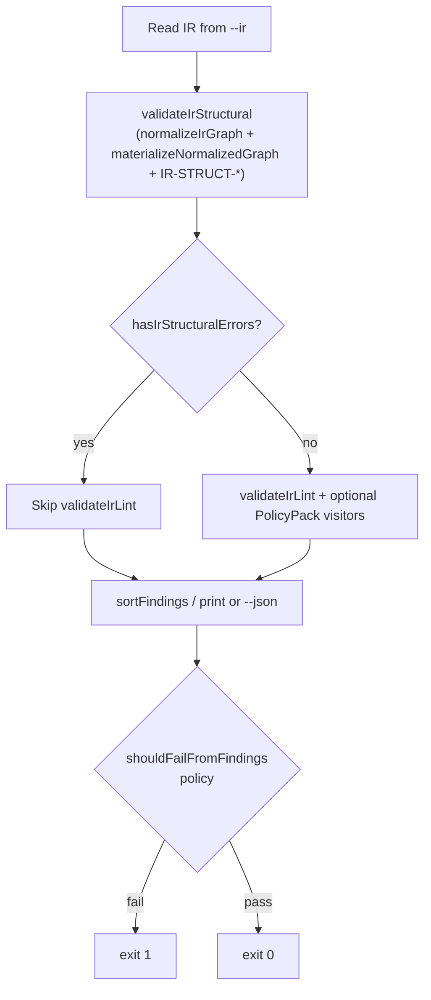
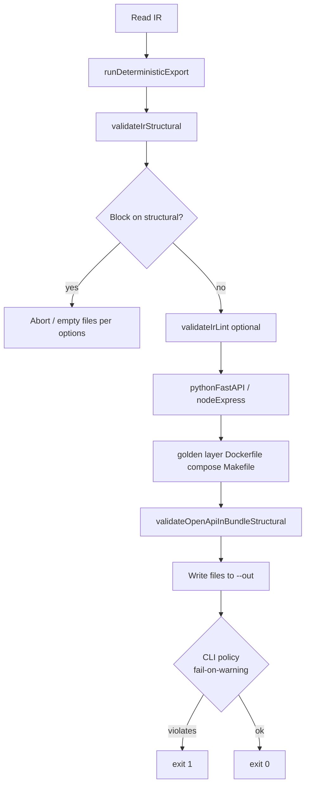
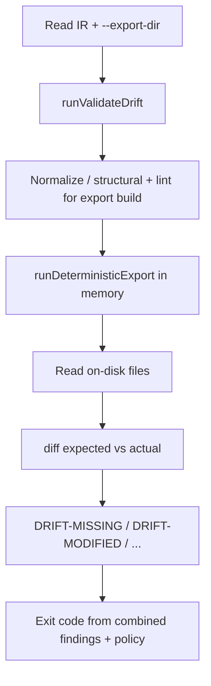
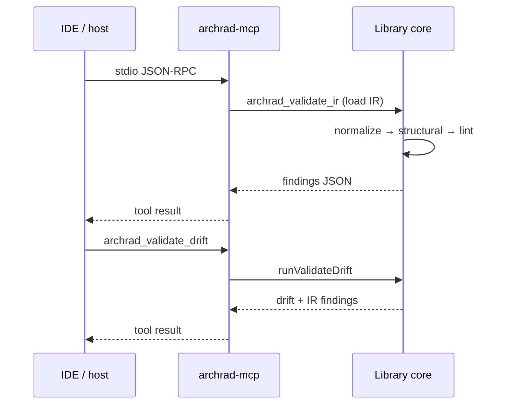
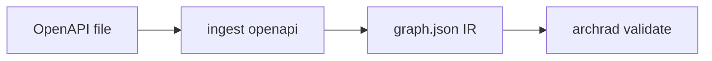

# OSS flow diagrams — `@archrad/deterministic`

**Doc revision:** v0.1.6 · package `@archrad/deterministic` 0.1.6 · 2026-04-10 · [OSS doc history & process](./OSS_DOCUMENTATION_VERSIONING.md)

Phase flows for the main **user-visible** paths. Component detail is in [OSS_ARCHITECTURE.md](./OSS_ARCHITECTURE.md).

---

## 1. `archrad validate`

Default path: **structural** (which internally runs `normalizeIrGraph` → `materializeNormalizedGraph` → ref/cycle/HTTP checks) → **lint** only when there are no structural **errors** (`hasIrStructuralErrors`); PolicyPack optional via `--policies`.

**Exit policy:** `error` severity always fails; warnings fail only with `--fail-on-warning` or `--max-warnings N`. See `cli-findings.ts`.

---

## 2. `archrad export`

Codegen path: structural → lint (unless skipped) → generate files → optional OpenAPI structural warnings on bundle.

---

## 3. `archrad validate-drift`

Compare **fresh** deterministic export from IR to **existing** directory tree.

---

## 4. MCP session (stdio)

Tools delegate to the same functions as the CLI; no separate “cloud” engine.

---

## 5. OpenAPI ingest (high level)

Separate command path: spec → canonical IR graph (not shown in full here); output feeds **`archrad validate`** like any other IR file.

---

## See also

- [OSS_DESIGN.md](./OSS_DESIGN.md)
- [OSS_ARCHITECTURE.md](./OSS_ARCHITECTURE.md)
- [CI.md](./CI.md) — pipeline snippets
